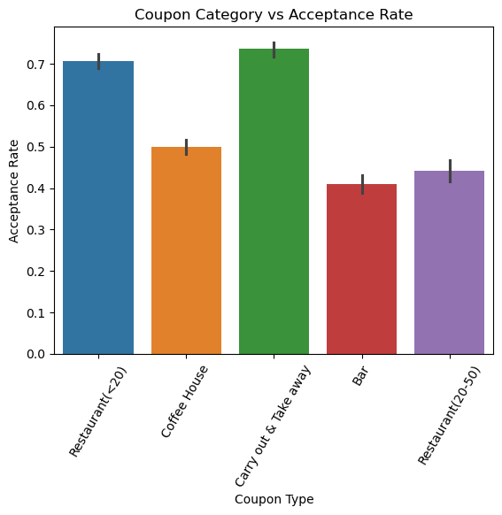
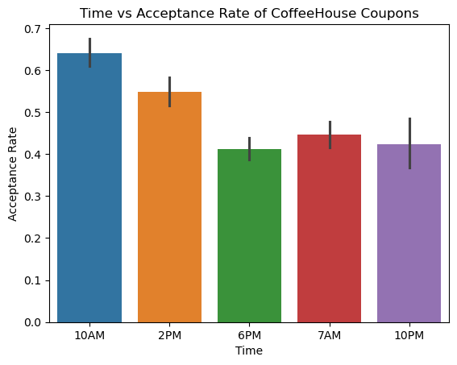
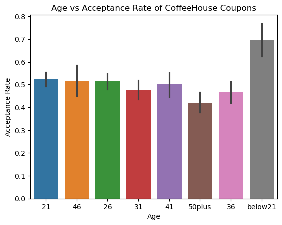
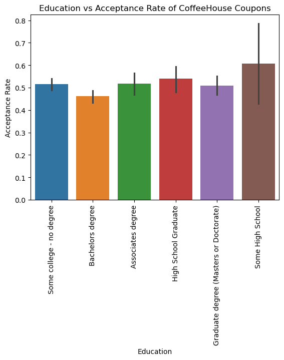
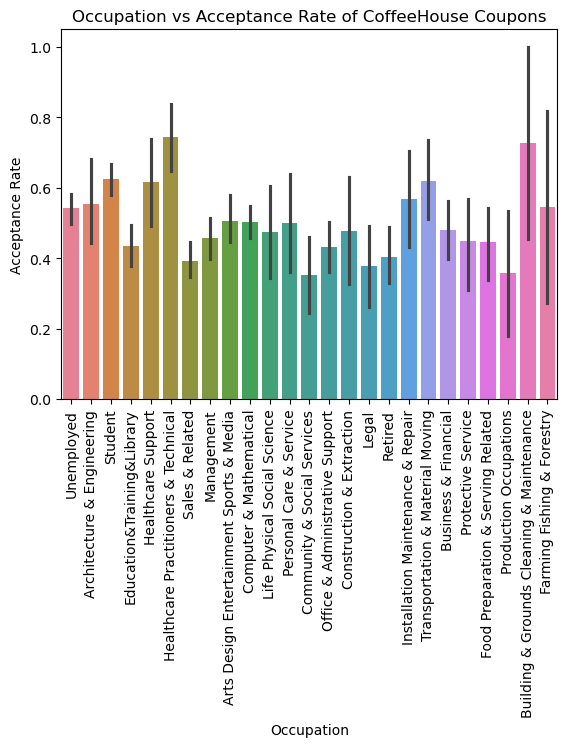
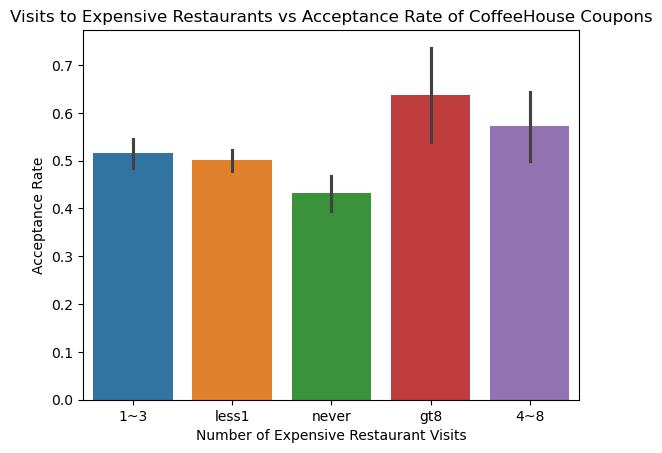

# Assignment 5.1: Will the Customer Accept the Coupon
[Link to Jupyter Notebook](assignment_submission.ipynb)

## General Findings
For all coupons, the overall acceptance rate is 57%. By coupon type, Restaurant(<20) and Carry out & Take away had the highest acceptance percentage.

Temperature Distribution:

## Bar Coupon Analysis

The acceptance rate of bar coupons was 41%. 
In specific subcategories however, the rate of acceptance varied. For example if someone visited the bar more than 3 times, the acceptance rate of the coupon was 76%. On the other hand, the acceptance rate of people who visited the bar 3 or fewer times was 37%.

For the driver group specifically, there were some interesting insights for the acceptance rate of coupons.
- The acceptance rate of the bar coupon for drivers who are older than 25 is 69.5%, and the acceptance rate for everyone else not in the group is 33.5%.
- The acceptance rate of acceptance rate between drivers who go to bars more than once a month and had passengers that were not a kid and had occupations other than farming, fishing, or forestry. 71%
The acceptance rate of everyone else not in the group is 30%
- The acceptance rate of people who go to bars more than once a month, had passengers that were not a kid, and were not widowed is 71%, the acceptance rate of people who go to bars more than once a month and are under the age of 30 is 64%, and the acceptance rate of people who go to cheap restaurants more than 4 times a month with an income that is less than 50K is 45%.

### Conclusion about Drivers who accepted the Bar Coupons
There are a few things that can hypothesized about drivers who accept bar coupons. The more drivers visit bars, the more likely they are to accept the coupon, perhaps due to the fact that they are more likely to use it. Furthermore, people who visit cheaper restaurants are more likely Additionally, younger people are more likely to accept a coupon to the bar, indicating that they may want to use the bar more.

## CoffeeHouse Coupon
In order to find characteristics of passengers who accepted the coupons, I did a brief exploratory analysis by looping through the dataset, and returning all specific columns and category where the acceptance rate was above 60%. 
The results were as follows

Time
- 10AM,  Acceptance Rate: 64.1% 

Age 
- below21,  Acceptance Rate: 70.0%

Education 
- Some High School,  Acceptance Rate: 61%
- Group occupation
Building & Grounds Cleaning & Maintenance,  Acceptance Rate: 0.72.7%
- Healthcare Practitioners & Technical,  Acceptance Rate: 74.3%
- Healthcare Support,  61.5%
- Student,  Acceptance Rate: 62.5%
- Transportation & Material Moving,  Acceptance Rate: 61.8%

Restaurant20To50
- gt8,  Acceptance Rate: 63.7%

From this brief exploratory analysis, I decided to focus in on the 5 groups, Time, Age, Education, and Restaurant20to50, and analyze them.

From these results there are a few things that can be hypothesized about people who accept Coffeehouse Coupons. They are more likely to accept it at 10 A.M., perhaps due to taking a break of some sort at this time. They are also far more likely to be younger than 21, which could imply they drink it during school to gain energy. This is further emphasized by the fact that students are also more likely to accept the coupon. Another thing that can be said about them is the fact that they probably have a large disposable income, due to the fact that people who visit the expensive restaurants often are more likely to accept the coupon.

There are a few more significant groups that could accept coffee. Judging by the results, since people who have at least some high school are more likely to accept the coupon (and the acceptance rate goes down as people are more educated), and the fact that occupations Building & Grounds Cleaning & Maintenance and Transportation & Material Moving have higher acceptance rates, blue collar workers are more likely to accept the coffee. Additionally, those in Healthcare are also more likely to accept the coupon, perhaps due to their long hours. 

## Next Steps
There are a few different ways this analysis could be expanded. There could be a more specific and segmented analysis to determine specifics about the groups that accepted. Different types of coupons could be tested to understand whether the type of coupon affects acceptance for specific groups. Lastly, there could be further analysis done to determine the subset that accepts the most coupons. This group would be the most effective group to send coupons to, as they would be the most likely to accept all coupons.

### Next Step Recommendation
My recommendation would be to go with the first option I suggested, more specific and segmented analysis to determine specifics about the groups that accepted. This would result in understanding the enthusiastic audience for the coffeeshop, and one that they should cater to.